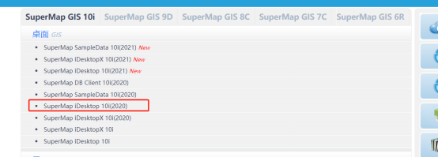
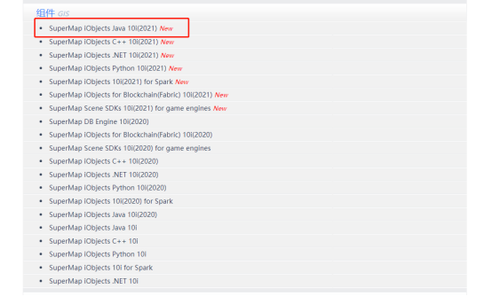
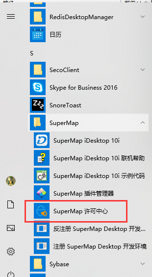
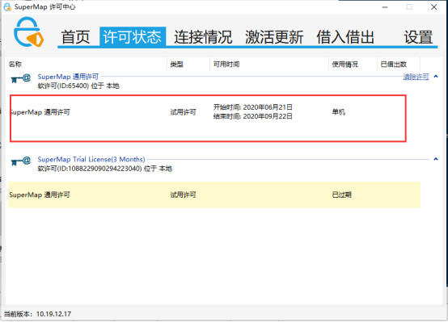
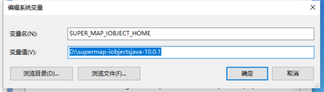
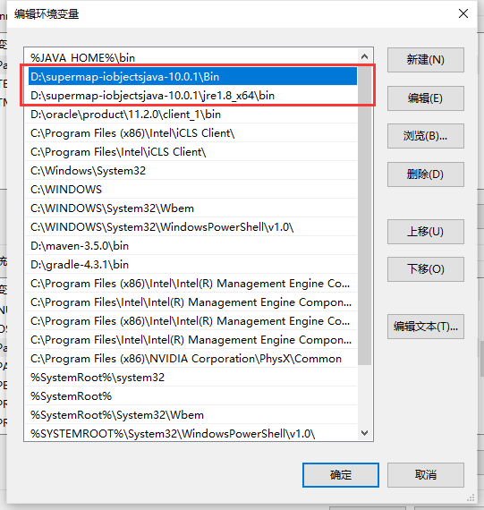

Wow!!!
A new world !!

# React GIS 前端面试题目

### 1.新建一个react单应用项目

### 2.在首页嵌入iserver服务并显示地球影像

参考代码及帮助 地形影像 (supermap.com.cn)
（http://support.supermap.com.cn:8090/webgl/examples/webgl/editor.html#terrainAndImagery）

### 3.页面样式及功能
（1）如图界面样式可以自行设计 包含三类地图数据 路线 桥梁 隧道
（2）设计搜索界面，可以根据关键子进行查询地图数据

iserver信息地址：  
桥梁数据链接
https://www.checcgtmap.com.cn/iserver6/services/map-fujian_map/rest/maps/QLPS  
隧道数据链接
https://www.checcgtmap.com.cn/iserver6/services/map-fujian_map/rest/maps/SDPS  
路线数据链接
https://www.checcgtmap.com.cn/iserver6/services/map-NMG_MAP/rest/maps/NMG_GAOSU  

### 4.在项目中创建test分支，然后提交commit请求到checcdata/zhaopin的test分支

### 5.主文件夹命名规则：react_gis_个人姓名拼音

------------

# SuperMap 后端面试题目

## 环境配置
### 1.准备：  
iObject java 10.0.1   
iDesktop 10.0.1  
下载地址：http://support.supermap.com.cn/DownloadCenter/ProductPlatform.aspx

超图的试用许可，试用需要去超图官网：  
http://www.supermapol.com/web/pricing/triallicense  
申请教程：http://qa.supermap.com/52677
2.安装idesktop，安装后注册用户、登录。  
3.查看许可  
  
  
查看许可是否过期，过期的话去超图官网申请新的许可添加进来。  
4.iObjects java就是一个本地开发包，需要将它添加的系统的path变量中去  

注意：将超图的这两个变量放在jdk变量的后边，防止影响jdk  
5.重启电脑  
6.检验iObject Java配置是否成功  

## 题目

### 1.安装iObject环境(参考文档)
### 2.基于iObject创建一个java项目
### 3.编写一个demo,计算线对象长度以及面对象面积

## 要求
## 4.在项目中创建test分支，然后提交commit请求到checcdata/zhaopin的test分支
## 5.主文件夹命名规则：map_个人姓名拼音
