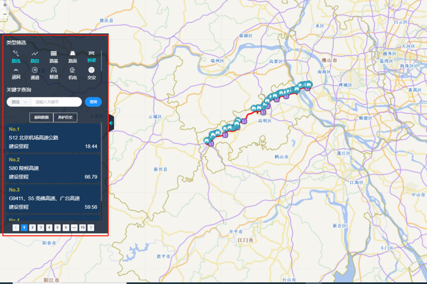

Wow!!!
A new world !!

## React GIS 前端面试题目

### 1.新建一个react单应用项目

### 2.在首页嵌入iserver服务并显示地球影像

参考代码及帮助 地形影像 (supermap.com.cn)
（http://support.supermap.com.cn:8090/webgl/examples/webgl/editor.html#terrainAndImagery）

### 3.页面样式及功能
（1）如图界面样式可以自行设计 包含三类地图数据 路线 桥梁 隧道
（2）设计搜索界面，可以根据关键子进行查询地图数据

iserver信息地址：  
桥梁数据链接
https://www.checcgtmap.com.cn/iserver6/services/map-fujian_map/rest/maps/QLPS  
隧道数据链接
https://www.checcgtmap.com.cn/iserver6/services/map-fujian_map/rest/maps/SDPS  
路线数据链接
https://www.checcgtmap.com.cn/iserver6/services/map-NMG_MAP/rest/maps/NMG_GAOSU  

### 4.在项目中创建test分支，然后提交commit请求到checcdata/zhaopin的test分支

### 5.主文件夹命名规则：react_gis_个人姓名拼音